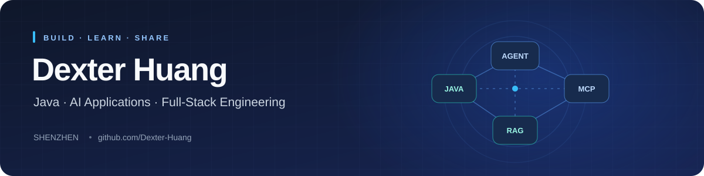

  <a href="https://github.com/Dexter-Huang">中文</a> | <strong>English</strong>

  

  <a href="#about">About</a> ·
  <a href="#projects">Projects</a> ·
  <a href="#stack">Toolbox</a> ·
  <a href="#connect">Connect</a>

  
  

## 👋 About

Hi, I'm **Dexter Huang**, based in Shenzhen.

This is where I share my work in **Java backend development, AI applications, and full-stack engineering**. From backend APIs and knowledge retrieval to web and desktop interfaces, I explore how these pieces come together in working applications.

- **AI applications**: exploring Agents, RAG knowledge bases, and MCP tool integration with Spring AI.
- **Backend engineering**: building with Java / Spring Boot and experimenting with PostgreSQL, Redis, and messaging.
- **Application delivery**: working with Vue / TypeScript frontends, Electron desktop apps, and automated builds.
- **Runtime experiments**: exploring GraalVM Native Image and Java native library integration through dedicated projects.

> Java, AI applications, and full-stack engineering — learning by building.

## 🚀 Selected Projects

| Project | What you'll find | Technologies |
| --- | --- | --- |
| **[OpenClaw4j](https://github.com/Dexter-Huang/OpenClaw4j)** | AI application and workflow experiments with Agent, knowledge base, and tool calling modules. The backend uses PostgreSQL / pgvector and includes MCP integration. | Java · Spring Boot · Spring AI · pgvector · MCP |
| **[geo-frontend-vue](https://github.com/Dexter-Huang/geo-frontend-vue)** | A public build mirror for the GEO frontend and desktop app, covering a Vue web application, an Electron desktop shell, and automated Windows / Linux packaging. | Vue 3 · TypeScript · Vite · Electron · GitHub Actions |
| **[redis-mq](https://github.com/Dexter-Huang/redis-mq)** | Redis-backed messaging experiments with listener annotations, listener scanning and registration, and Spring Boot auto-configuration. | Java · Spring Boot · Redis |
| **[test-graalvm](https://github.com/Dexter-Huang/test-graalvm)** | Spring Boot and GraalVM Native Image experiments, including Java FFM / Panama native library integration and MathType to LaTeX code. | Java · GraalVM · Spring Boot · FFM |

**More work**: browse [all public repositories](https://github.com/Dexter-Huang?tab=repositories), or explore the product showcase pages in [geo-webpage](https://github.com/Dexter-Huang/geo-webpage).

## 🛠️ Toolbox

These technologies appear in my public projects and experimental repositories.

  
  
  
  
  
  

| Area | Technologies used or explored |
| --- | --- |
| Backend | Java · Spring Boot · Maven |
| AI & retrieval | Spring AI · RAG · MCP · pgvector |
| Web & desktop | TypeScript · Vue 3 · React · Vite · Electron |
| Data & delivery | PostgreSQL · Redis · Docker · GitHub Actions |
| Runtime experiments | GraalVM Native Image · Java FFM / Panama |

## 🌱 Open Source & Learning

I also explore open-source tools by reading code and running experiments:

- **[Spring AI Alibaba](https://github.com/alibaba/spring-ai-alibaba)**: a Java AI application and Agent framework; [my fork](https://github.com/Dexter-Huang/spring-ai-alibaba).
- **[Camofox Browser](https://github.com/jo-inc/camofox-browser)**: browser automation for AI Agents; [my fork](https://github.com/Dexter-Huang/camofox-browser).
- **[FastGPT](https://github.com/labring/FastGPT)**: knowledge base Q&A and visual workflows; [my FastGPT-based practice repository](https://github.com/Dexter-Huang/myFastgpt).

## 🤝 Connect

Happy to exchange ideas on **Java backends, AI applications, RAG / MCP, and web or desktop development**. For questions or suggestions about a project, please open an Issue in its repository.

- **GitHub**: [Dexter-Huang](https://github.com/Dexter-Huang)
- **Projects**: [All repositories](https://github.com/Dexter-Huang?tab=repositories)

📊 GitHub Activity & Languages

 

Statistics cards are provided by a third-party service. Language distribution reflects the code in public repositories.

